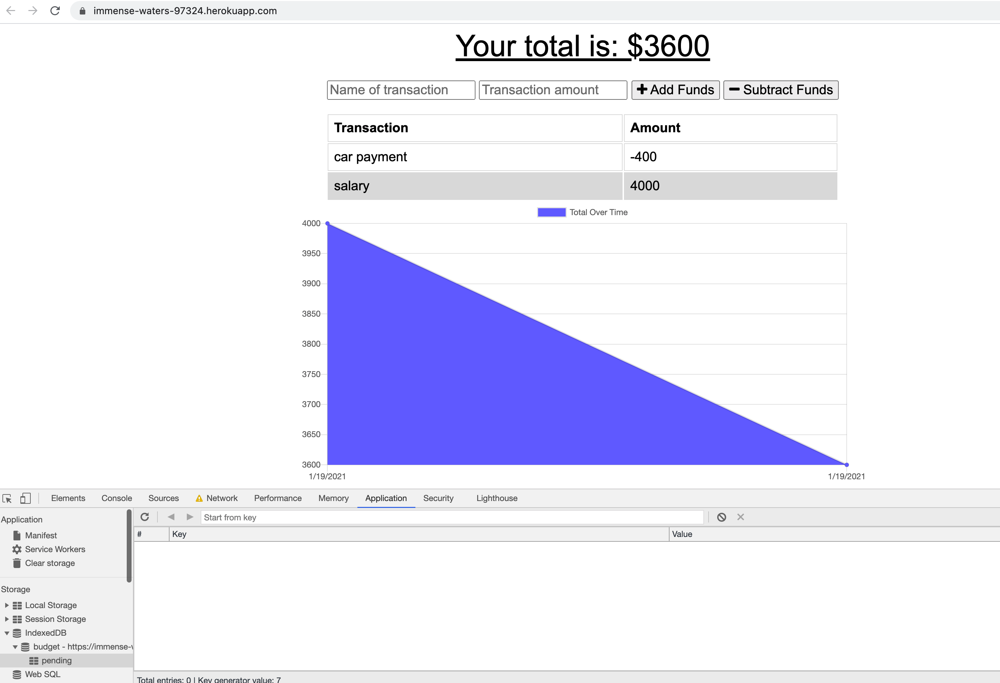
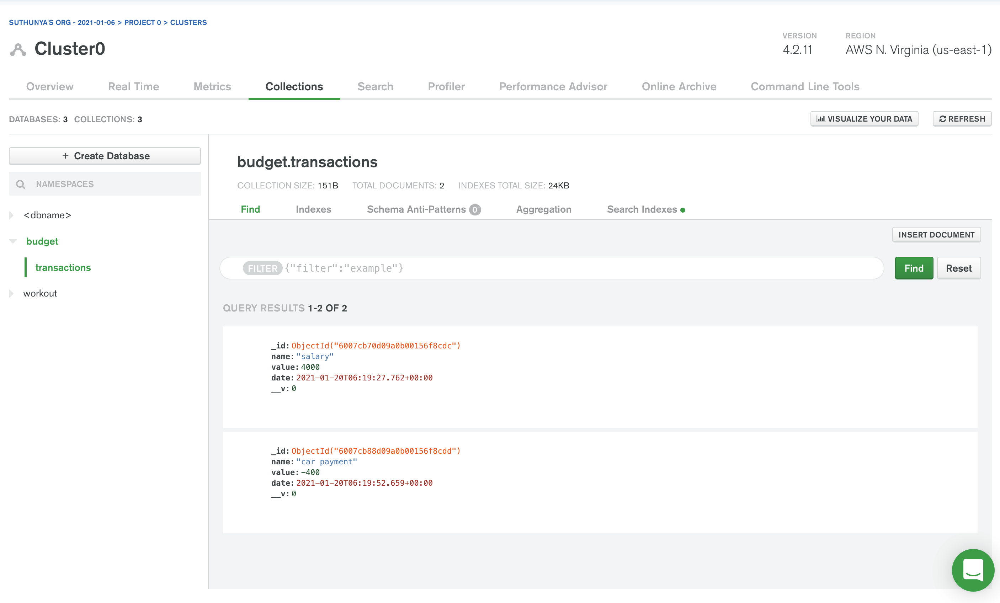
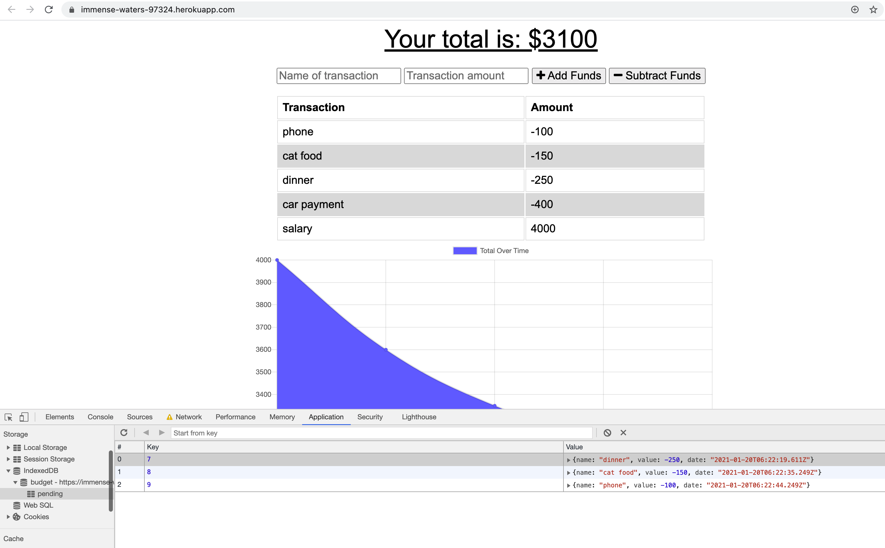
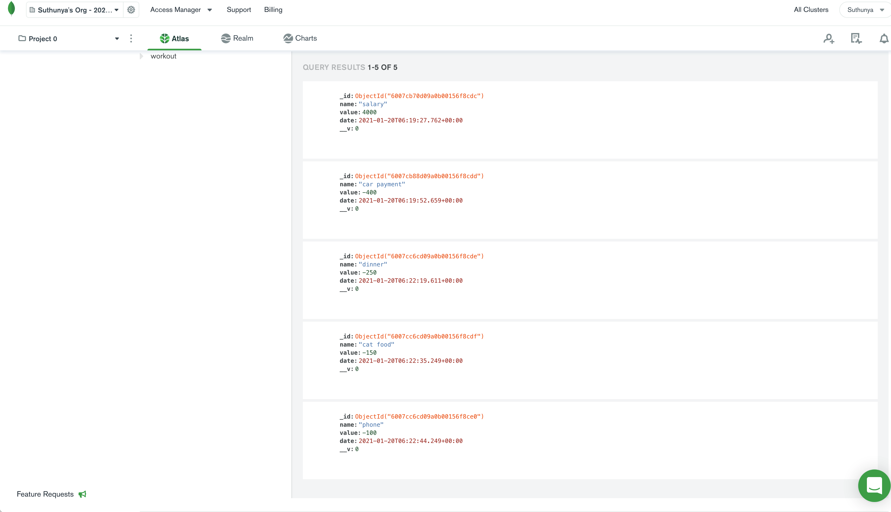
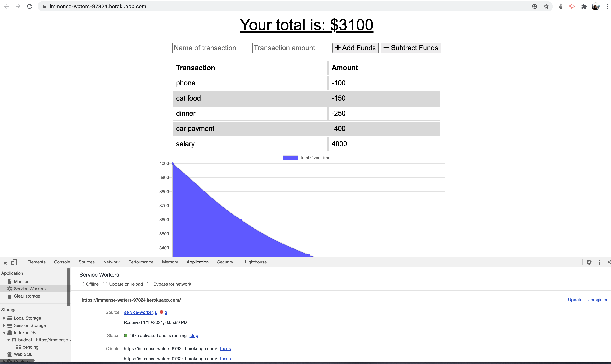

# Budget-Trackers  

## Table of Content

* [Installation Instructions](#Installation-Instruction)
* [Description](#Description )
* [Usage Information](#Usage-Information)
* [License](#License)
* [Contributing Guildline](#Contributing-Guildline)
* [Tests Instructions](#Tests-Instructions)
* [Demonstration Link](#Demonstration-Link)
* [Questions](#Questions)

## Installation Dependencies
* npm install compression express mongoose morgan

## Description
* Giving users a fast and easy way to track their money is important, but allowing them to access that information anytime is even more important. Having offline functionality is paramount to our applications success.

## Usage Information
* In this project, the user will be able to add expenses and deposits to their budget with or without a connection. The offline entries will be added to tracker,  when connection is back online.

## License

## Contributing Guildeline
* I encourage public contributions.

## Tests Instructions
* The user will be able to add their withdrawals and or deposits with or without a data/internet connection. In the picture below, the user input their deposit and withdrawal when the connection is online to the tracker   

 
 

* When the user add more withdrawal offline, the offline entries will be corrected in indexedDB. 

 

* Once the connection is back online, the offline entries will be added to the tracker. 

 
 

## Demonstration Link
* 

## Questions

  * Github user name :   saipurciful
  * Github link : https://github.com/Saipurciful
  * How to reach me with additional questions : <saipurciful@gmail.com>

## Link to the project site. 
* https://immense-waters-97324.herokuapp.com/
